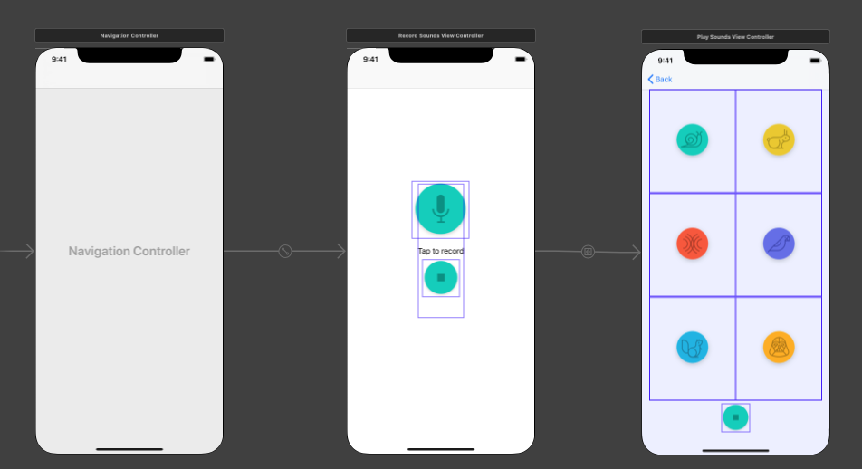
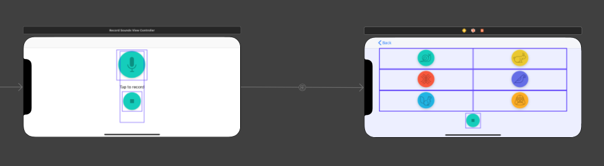

#### Pitch Perfect

Description: IOS app that plays back a audio recording with different effects

---

### Architecture

#### Scenes

App contains two scenes: One for recording an audio file (RecordSoundsViewController.swift) and one for playing the audio file with different sound effects (PlaySoundsViewController.swift). A UINavigationController
allows the navigation between the two scenes possible. Also allows the re-recording of audio on the first  
scene.

#### UI elements

All UI elements use constraints that aid element into positioning whether being displayed on a IPhone or Ipad, both in landscape or portrait mode.




#### Actions, Outlets and labels

The first scene (RecordSoundsViewController.swift) contains two IBActions, one for starting (recordAudio) and one for stopping the recording (stopRecording). When the first scene loads, the Stop Recording button is disabled by viewDidload, preventing the second scene loading without a audio file.

When the recordAudio button is pressed a IBAction function is executed and will start the recording as well as saving the audio file (recordedVoice.wav). Also switching the label (recordLabel) from "Tap to record" to "Recording in Progress...". Recorded audio button's IBAction function enables the "stopRecordingButton" through its IBOutlet. When stopRecordingButton is pressed a delegate (url) is passed as a seque to the second view controller "PlaySoundsViewController".

Play Sounds View Controller contains seven IBOutlet that connect to the seven buttons in the view. Each sound effect button is linked to a single IBAction function that uses a switch case to correctly match the button to its sound effect. The stop button is linked to its own IBAction that will stop the play back.

#### AVAudioRecorder

Audio recording uses the AVAudioRecorder within the AVFoundation library.

``` javascript
let dirPath = NSSearchPathForDirectoriesInDomains(.documentDirectory,.userDomainMask, true)[0] as String
let recordingName = "recordedVoice.wav" // .wav
let pathArray = [dirPath, recordingName]
let filePath = URL(string: pathArray.joined(separator: "/"))

let session = AVAudioSession.sharedInstance()
try! session.setCategory(AVAudioSession.Category.playAndRecord, mode: AVAudioSession.Mode.default, options: AVAudioSession.CategoryOptions.defaultToSpeaker)

// Start the audio recording and save it to the url created above

try! audioRecorder = AVAudioRecorder(url: filePath!, settings: [:])
audioRecorder.delegate = self
audioRecorder.isMeteringEnabled = true
audioRecorder.prepareToRecord()
audioRecorder.record()
```

#### Delegates and Segues

A segue is used to trigger the view to switch to the second scene. The segue itself is the url of the audio file that will be used in the playback. An identifier prevents the need for hard coding the seque to the stopRecordingButton.

```javascript
@IBAction func stopRecording(_ sender: Any) {
    recordLabel.text = "Tap to record"
    stopRecordingButton.isEnabled = false    // Disable stopRecoding button
    recordButton.isEnabled = true           // Enable recording button
    audioRecorder.stop()                    // stop the audioRecording
    let audioSession = AVAudioSession.sharedInstance()
    try! audioSession.setActive(false)
}

// MARK: audioRecorderDidFinishRecording/create segue
// set up segue

func audioRecorderDidFinishRecording(_ recorder: AVAudioRecorder, successfully flag: Bool) {
    if flag{
        performSegue(withIdentifier:"stopRecording", sender: audioRecorder.url)
    }else{
        print ("recording was not successful")
    }
}

// send seque to playsoundsViewController
override func prepare(for segue: UIStoryboardSegue, sender: Any?) {
    if segue.identifier == "stopRecording"{
        let playSoundsVC = segue.destination as! PlaySoundsViewController
        let recordedAudioURL = sender as! URL
        playSoundsVC.recordedAudioURL = recordedAudioURL
    }
}
```

### Getting Started

First clone the git repo.

  git clone  https://github.com/MitchTODO/PitchPerfect-IOS-app.git

Second extract the xcodeproject zip

    PitchPerfect.xcodeproj.zip

Third run xcode and on startup click on open another project. Select the unzipped PitchPerfect.xcodeproj and press open.
